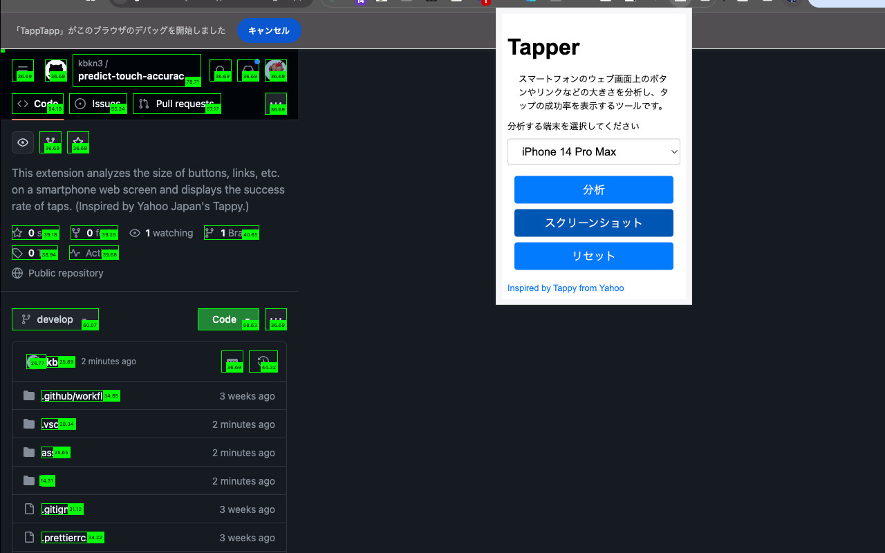

# Tap Analyzer

この拡張機能は、スマートフォンのウェブ画面上のボタンやリンクなどのサイズを分析し、タップの成功率を表示します。
Yahoo Japan Labが開発した[Tappy](https://tappy.yahoo.co.jp/)にインスパイアされ、Chrome拡張機能化したものです。

This extension analyzes the size of buttons, links, etc. on a smartphone web screen and displays the success rate of taps.
Inspired by [Tappy](https://tappy.yahoo.co.jp/) developed by Yahoo Japan Lab, it has been made into a Chrome extension.



## Getting Started

First, run the development server:

```bash
pnpm dev
# or
npm run dev
```

## Making production build

Run the following:

```bash
pnpm build
# or
npm run build
```

This should create a production bundle for your extension, ready to be zipped and published to the stores.
